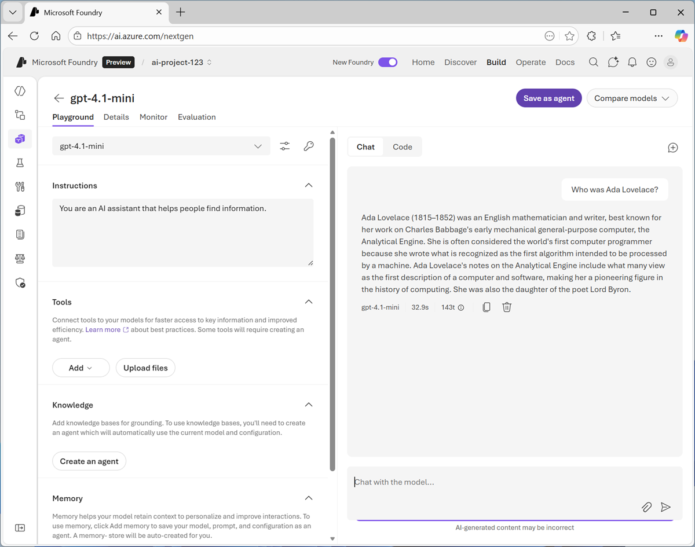
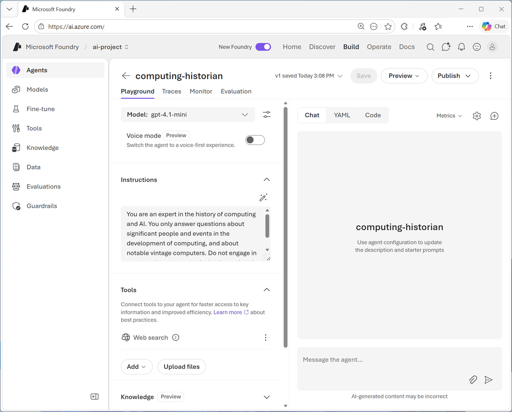
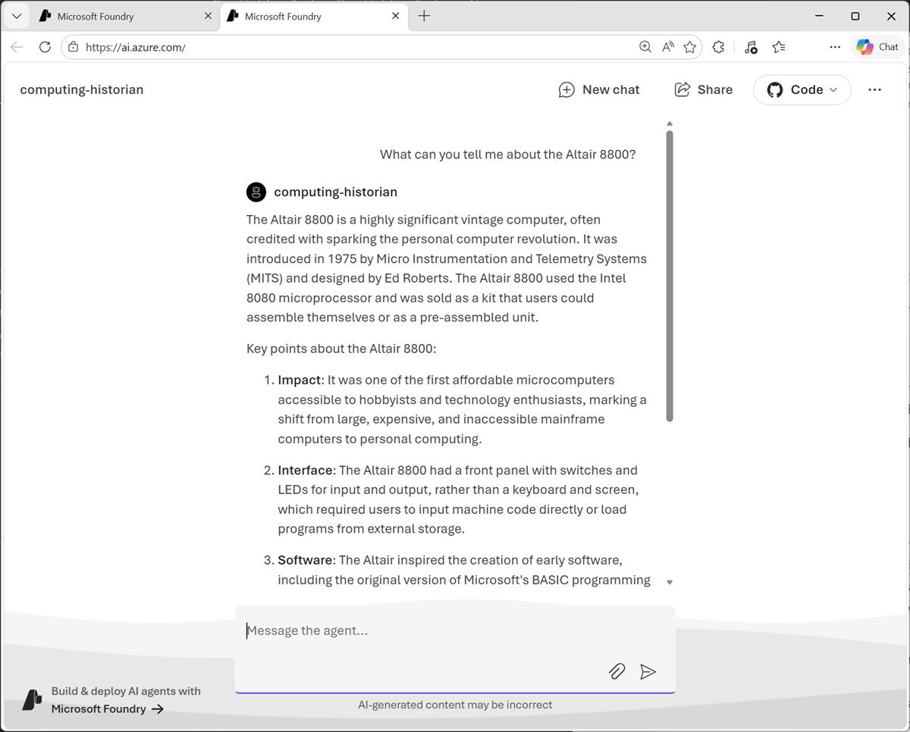

---
lab:
  title: Get started with agent development in Microsoft Foundry
  description: Use Microsoft Foundry to deploy a generative AI model and create an agent.
  level: 200
  duration: 20 minutes
  islab: true
---

# Get started with agent development in Microsoft Foundry

In this exercise, you'll use Microsoft Foundry to start developing an AI agent that provides information and expertise on the history of computing.

> **Note**: Many components of Microsoft Foundry, including the Microsoft Foundry portal, are subject to continual development. This reflects the fast-moving nature of artificial intelligence technology. Some elements of your user experience may differ from the images and descriptions in this exercise!

This exercise should take approximately **20** minutes to complete.

## Create a Microsoft Foundry project

Microsoft Foundry uses *projects* to organize models, resources, data, and other assets used to develop an AI solution.

1. In a web browser, open [Microsoft Foundry](https://ai.azure.com){:target="_blank"} at `https://ai.azure.com` and start building; signing in using your Azure credentials. Close any tips or quick start panes that are opened the first time you sign in, and if necessary use the **Foundry** logo at the top left to navigate to the home page.

1. If it is not already enabled, in the tool bar the top of the page, enable the **New Foundry** option. Then, if prompted, create a new project with a unique name; expanding the  **Advanced options** area to specify the following settings for your project:
    - **Foundry resource**: *A valid name for your Foundry resource.*
    - **Subscription**: *Your Azure subscription*
    - **Resource group**: *Create or select a resource group*
    - **Region**: Select any of the **AI Foundry recommended** regions in [this list](https://learn.microsoft.com/azure/foundry/openai/how-to/responses#region-availability){:target="_blank"}

1. Wait for your project to be created. It may take a few minutes. Then close any welcome dialogs that are displayed.

    After creating or selecting a project in the new Foundry portal, it should open in a page similar to the following image:

    

## Deploy a model

At the heart of every AI agent, there's a large language model (LLM). Let's find one in the Foundry models catalog.

1. Now you're ready to explore models. On the **Discover** page, select the **Models** tab to view the Microsoft Foundry model catalog.

    Microsoft Foundry provides a large collection of models from Microsoft, OpenAI, and other providers, that you can use in your AI apps and agents.

    

1. Search for and select the `gpt-4.1-mini` model, and view the page for this model, which describes its features and capabilities.

    

1. Use the **Deploy** button to deploy the model using the default settings. Deployment may take a minute or so.

    > **Tip**: Model deployments are subject to regional quotas. If you don't have enough quota to deploy the model in your project's region, you can use a different model - such as gpt-4.1-nano, or gpt-4o-mini. Alternatively, you can create a new project in a different region.

1. When the model has been deployed, view the model playground page that is opened, in which you can chat with the model.

    

## Chat with the model

You can use the playground to explore the model by chatting with it.

1. Use the button at the bottom of the left navigation pane to hide it and give yourself more room to work with.
1. In the **Chat** pane, enter a prompt such as `Who was Ada Lovelace?`, and review the response.

    

1. Enter a follow-up prompt, such as `Tell me more about her work with Charles Babbage.` and review the response.

    > **Note**: Generative AI chat applications often include the conversation history in the prompt; so the context of the conversation is retained between messages. In this case, "her" is interpreted as referring to Ada Lovelace.

1. At the top-right of the chat pane, use the **New chat** button to restart the conversation. This removes all conversation history.
1. Enter a new prompt, such as `Tell me about the ELIZA chatbot.` and view the response.
1. Continue the conversation with prompts such as `How does it compare with modern LLMs?`.

## Specify instructions in a *system prompt*

To support specific use cases, you should use a *system prompt* to provide the model with instructions that guide its responses. You can use the system prompt to give the model a specific focus or role, and provide guidelines about format, style, and constraints about what the model should and should not include in its responses.

1. In the model playground, at the top-right of the chat pane, use the **New chat** button to restart the conversation and remove the conversation history.
1. In the pane on the left, in the **Instructions** text area, change the system prompt to:

    ```
   You are an expert in the history of computing and AI. You only answer questions about significant people and events in the development of computing, and about notable vintage computers. Do not engage in conversations on any topic that is unrelated to computing history.
    ```

1. Now enter a new user prompt related to computing history, such as `What was Alan Turing's contribution to the development of AI?`

    Review the response, which should provide some history of computing information.

1. Try asking an "off-topic" question, such as `What's the capital of Spain?`; and view the response.

## Add a web_search tool

So far, the model has answered questions based on the data with which it was trained. While this is useful, that leaves out a lot of current information on the web; which might help the model give more relevant answers.

We can use *tools* to give models access to external data sources, and to perform custom tasks. Let's add a tool that enables the model to search the Web for up-to-date information.

1. In the pane on the left, under the instructions, expand the **Tools** section if it is not already expanded.
1. In the **Add** drop-down list, select **Web search**. Then read the information about the tool.
1. After adding the *web_search* tool, in the chat pane, enter the prompt `Find a vintage computer store near Seattle` (*or your local city!*) and review the response.

    The model should have searched the Web for vintage computer stores near the specific city.

## Save the model configuration as an agent

While you can implement generative AI apps using a standalone model, to create a fully agentic AI experience, you need to encapsulate the model, its instructions, and any tool configuration that provides additional functionality, in an *agent*.

1. In the model playground, at the top right select **Save as agent**. Then, when prompted, name your new agent `computing-historian`.

    When the agent is created, it opens in a new playground specifically for working with agents.

    

1. In the pane on the right, view the **YAML** tab, which contains the definition for your agent. Note that its definition includes the model, its parameter settings, and the instructions you specified - similar to this:

    ```yml
    metadata:
      logo: Avatar_Default.svg
      microsoft.voice-live.enabled: "false"
    object: agent.version
    id: computing-historian:1
    name: computing-historian
    version: "1"
    description: ""
    created_at: 1776550090
    definition:
      kind: prompt
      model: gpt-4.1-mini
      instructions: You are an expert in the history of
        computing and AI. You only answer questions
        about significant people and events in the
        development of computing, and about notable
        vintage computers. Do not engage in
        conversations on any topic that is unrelated to
        computing history.
      temperature: 1
      top_p: 1
      tools:
        - type: web_search
    status: active
    ```

1. Switch back to the **Chat** tab, and enter the prompt `Who are you?`

    The response should indicate that the agent is "aware" of its role as a computing historian.

## Preview the agent

Now you have a working agent, you can preview it in a basic web chat application.

1. At the top of the chat pane, in the **Publish** drop-down list, select **Preview web app**.

    A preview chat interface is opened in a new browser tab.

1. Enter a prompt, such as `What can you tell me about the Altair 8800?` and view the response from your agent.

    

## Summary

In this exercise, you explored how to deploy and chat with a generative AI model in Microsoft Foundry portal. You then configured instructions and tools before saving the model as an agent.

> **[Ask Anton](https://aka.ms/azk-anton){:target="_blank"}**<br/><br/>If you have questions about some of the topics covered in this exercise, *[Ask Anton](https://aka.ms/choose-anton){:target="_blank"}* is a generative AI-based agent that you can ask about AI concepts and Microsoft Foundry. Choose the Azure-based or Browser-based version of the app at **[https://aka.ms/choose-anton](https://aka.ms/choose-anton){:target="_blank"}**.<br/><br/>*Ask Anton is not a supported Microsoft product or a component of Microsoft Learn or AI Skills Navigator. Just an experimental example of an AI agent for you to explore as you learn about what's possible with AI.*<br/><br/>If you *do* check out Ask Anton, we'd love you to *[tell us about your experience](https://forms.office.com/r/fC0ndfBQeK){:target="_blank"}*!

## Next steps

This is the first in a series of lab exercises; save your work and continue to the **[next exercise](./02-continue-in-vscode.md)** if you're ready.

> **Tip**: If you have finished exploring Microsoft Foundry, you should delete the Azure resources created in this exercise to avoid unnecessary utilization charges.
