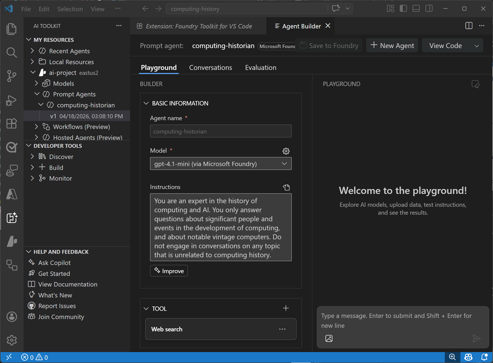
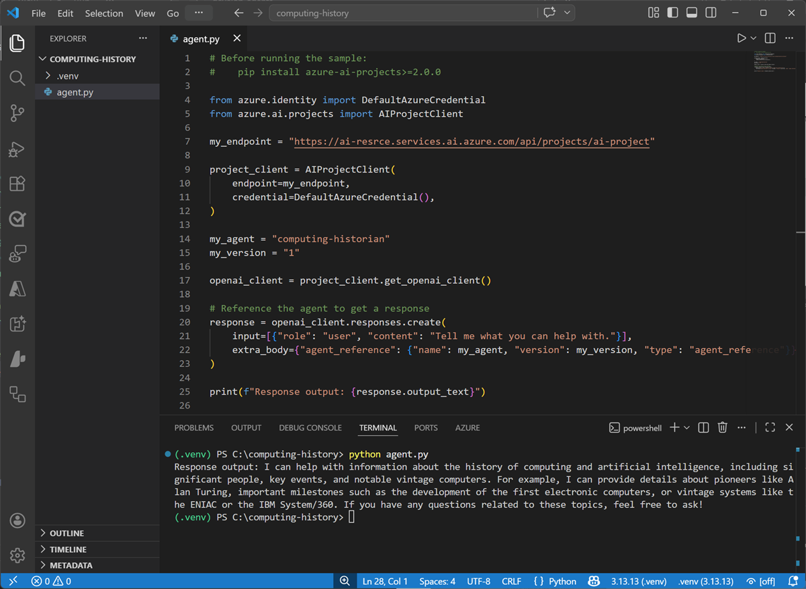
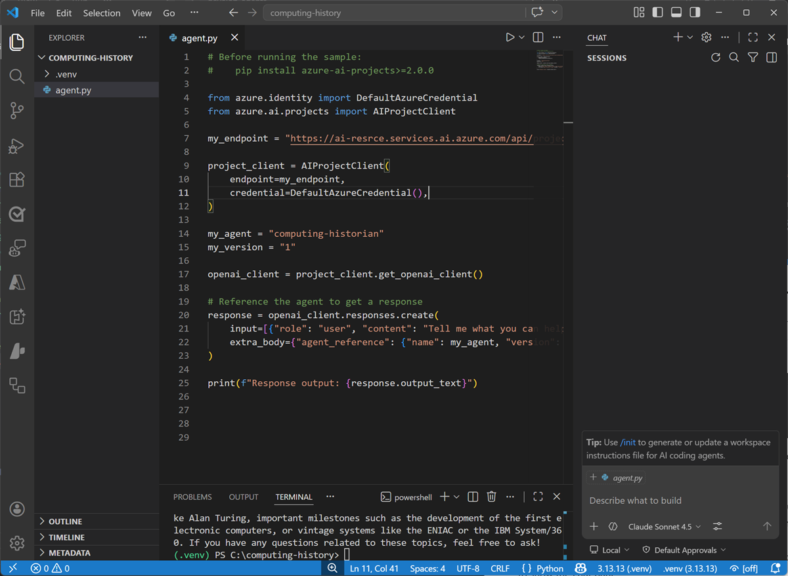
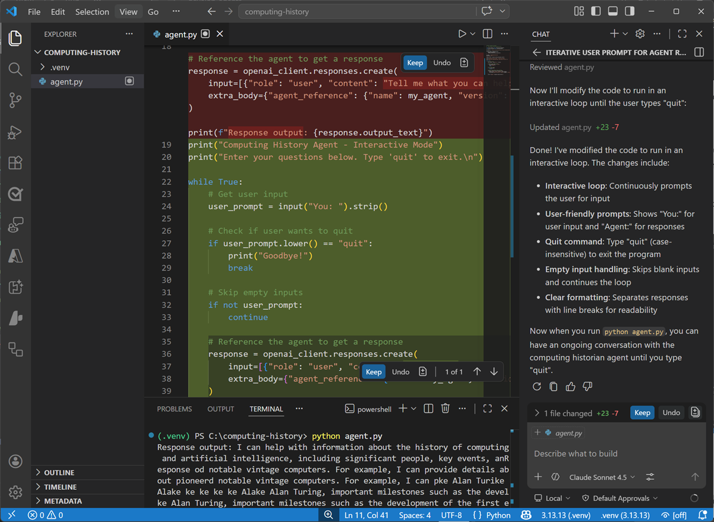

---
lab:
  title: Continue developing your agent in Visual Studio Code
  description: Use Visual Studio Code to develop and test your agent.
  level: 200
  duration: 20 minutes
  islab: true
---

# Continue developing your agent in Visual Studio Code

In the **[previous exercise](./01-get-started-in-foundry.md)**, you used Microsoft Foundry to start developing an AI agent that provides information and expertise on the history of computing.

Now you're ready to continue developing your agent using the Foundry integration features of Visual Studio Code.

This exercise should take approximately **20** minutes to complete.

## Install the Foundry Toolkit extension for Visual Studio Code

The Foundry Toolkit extension for Visual Studio Code brings the assets in your Foundry projects right into the development environment.

1. Start Visual Studio Code
1. In the navigation bar on the left, view the **Extensions** page.
1. Search the extensions marketplace for `Foundry Toolkit`, and install the **Foundry Toolkit for VS Code** extension.

    The extension may take a minute or so to install.

1. After installing the extension, select the **Foundry Toolkit** page in the left navigation bar; and wait for it to load.

    

1. In the Foundry Toolkit pane, expand **Microsoft Foundry Resources** and set the default project by connecting to Azure (signing in with your credentials) and selecting the Foundry project you created previously.

    > **Tip**: If you did not complete the previous exercise, use the extension to sign into Azure and create a new project.

## Connect to your agent

Now that you have a connection to your Foundry project, you can access the assets you've created in it - including the *computing-history* agent you created in the previous exercise.

> **Tip**: If you didn't complete the previous exercise, or have deleted your *computing-history* agent, use the **+** icon for the **Prompt agents** node to create a new agent named `computing-history` based on the *gpt-4.1-mini* model with the instructions `You are an expert in the history of computing and AI.` and add the *Web search* tool.

1. In the Foundry Toolkit pane, under your project, expand **Prompt agents**, expand select the **computing-history** agent you created previously, and select the version 1 implementation of the agent (or the latest version if you saved additional changes in the Foundry portal).

    The agent is opened in the **Agent Builder** interface within Visual Studio Code, so you can continue to develop and test it.

    

## Write code to test your agent

While you can use the graphical interface in the Foundry Portal and the Foundry Extension in Visual Studio code to develop and test an agent, eventually you'll want to write and test code. You can use the Azure AI Projects SDK and the OpenAI Responses API to do so.

1. In the **Explorer** pane, open the folder in which you want to store your application files - creating a new folder named `computing-history` on your local disk.

    You may be prompted to trust the owners of the folder.

1. View the **Extensions** pane; and if it is not already installed, install the **Python** extension.
1. In the **Command Palette (Ctrl+Shift+P)**, use the command `python:create environment` (or `python:select interpreter`) to create a new **Venv** environment based on your Python 3.1x installation.
1. Select the **Explorer** pane, and confirm that a new folder named **.venv** has been created in the **computing-history** root folder - this contains the runtime files for the Python environment you'll use for your application.
1. In the **Explorer** pane, in the **computing-history** folder, add a new file named `agent.py`. This is the code file in which you'll write your Python code.
1. Switch back to the **Foundry Toolkit** pane. Then right-click the latest version of the agent and select **View code**. Then when prompted, select the following options:
    - **SDK**: Microsoft Foundry Projects client library
    - **Language**: Python
    - **Authentication**: Entra ID

    A sample code file to connect to your agent and submit a prompt is opened. The code should look similar to this:

    ```python
    # Before running the sample
    # pip install azure-ai-projects>=2.0.0
    
    from azure.identity import DefaultAzureCredential
    from azure.ai.projects import AIProjectClient
    
    my_endpoint = "https://{your_foundry_resource}.services.ai.azure.com/api/projects/{your_project}"
    
    project_client = AIProjectClient(
        endpoint=my_endpoint,
        credential=DefaultAzureCredential(),
    )
    
    my_agent = "computing-historian"
    my_version = "1"
    
    openai_client = project_client.get_openai_client()
    
    # Reference the agent to get a response
    
    response = openai_client.responses.create(
        input=[{"role": "user", "content": "Tell me what you can help with."}],
        extra_body={"agent_reference": {"name": my_agent, "version": my_version, "type": "agent_reference"}},
    )
    
    print(f"Response output: {response.output_text}")
    ```

1. Copy and paste the code into your **agent.py** code file. Then close the sample code tab.
1. Save the changes to the **agent.py** file. in the **Explorer** pane, right-click the **agent.py** file, and select **Open in integrated terminal**.

    > **Note**: Opening the terminal in Visual Studio Code should automatically activate the Python environment after a few seconds. If you're using a PowerShell terminal, you may need to enable running scripts on your system (see [Set-ExecutionPolicy](https://learn.microsoft.com/powershell/module/microsoft.powershell.security/set-executionpolicy){:target="_blank"}). If for any reason the Python environment is not activated automatically, you can use [this query](https://www.bing.com/search?q=%22How%20do%20I%20activate%20a%20Python%20venv%22){:target="_blank"} to search for information on how to activate it in your environment.

1. Ensure that the terminal is open in the **computing-history** folder with the prefix **(.venv)** to indicate that the Python environment you created is active.

    > **Tip**: You can enter the command `cls` to clear the console pane - which may make it easier to focus on the outputs from commands as you run them.

1. Install the Azure AI projects and OpenAI SDKs by running the following command:

    ```bash
    pip install azure-ai-projects>=2.0.0 openai
    ```

1. After the libraries are installed (which may take a minute or so), use the following command to sign into Azure.

    ```bash
    az login
    ```

    > **Note**: In most scenarios, just using *az login* will be sufficient. However, if you have subscriptions in multiple tenants, you may need to specify the tenant by using the *--tenant* parameter. See [Sign into Azure interactively using the Azure CLI](https://learn.microsoft.com/cli/azure/authenticate-azure-cli-interactively) for details.

1. When prompted, follow the instructions to sign into Azure. Then complete the sign in process in the command line, viewing (and confirming if necessary) the details of the subscription containing your Foundry resource.
1. After you have signed in, enter the following command to run the application:

    ```bash
   python agent.py
    ```

    The code should run in the terminal, submit the prompt "*Tell me what you can help with.*" to your agent, and display the response (if not, resolve any errors and try again).

    

## Use GitHub Copilot to expand your code

GitHub Copilot provides agentic AI assistance in Visual Studio Code, helping you develop applications more efficiently.

> **Note**: GitHub Copilot in Visual Studio Code requires that you are signed in using a GitHub account. While agentic assistance is available in all GitHub plans, including free accounts, there are usage limitations.

1. In Visual Studio Code, in the **Extensions** pane, ensure that the **GitHub Copilot Chat** extension is installed and enabled.
1. At the bottom of the activity bar on the left, select **Accounts** and ensure that you are signed into your GitHub account. If not, sign in to use AI features.
1. On the toolbar, next to the search box, use the **Toggle Chat** button to show the chat pane on the right.

    

    The **Chat** pane is where you configure and use GitHub Copilot and connected agents to assist you with development tasks. You can select the model that GitHub Copilot uses, configure tools, and add custom agents. We'll use the default settings in this exercise.

1. Ensure the **agent.py** code file is open in the editor, then in the **Chat** pane, enter the following prompt:

    ```
    Modify the code to iteratively ask the user to enter a prompt for the agent and display the results, running until the user enters "quit". 
    ```

1. Enter the prompt, and wait while GitHub Copilot reviews and modifies your code. Eventually the changes will be staged and displayed.

    

1. With the changes staged, in the terminal, re-run the code (`python agent.py`).

    This time the app should continually ask you to enter a prompt and display the results until you enter "quit". (if not, continue to iterate with GitHub Copilot in the chat pane, explaining the behavior you want and any errors that occur until the code works as expected.)

    Some suggested prompts to try:

    - `Tell me about the Commodore 64`
    - `What was the ZX Spectrum?`
    - `What was Grace Hopper's contribution to computing?`

    When you're finished, enter `quit`.

1. If you're happy with the code that GitHub Copilot has generated, use the **Keep** button in the **Chat** pane to confirm the changes.

## Summary

In this exercise, you used the Foundry Toolkit extension in Visual Studio Code and the Azure AI Projects SDK to develop an agentic solution. You also used GitHub Copilot to get agentic AI assistance when developing your solution.

> **[Ask Anton](https://aka.ms/azk-anton){:target="_blank"}**<br/><br/>If you have questions about some of the topics covered in this exercise, *[Ask Anton](https://aka.ms/choose-anton){:target="_blank"}* is a generative AI-based agent that you can ask about AI concepts and Microsoft Foundry. Choose the Azure-based or Browser-based version of the app at **[https://aka.ms/choose-anton](https://aka.ms/choose-anton){:target="_blank"}**.<br/><br/>*Ask Anton is not a supported Microsoft product or a component of Microsoft Learn or AI Skills Navigator. Just an experimental example of an AI agent for you to explore as you learn about what's possible with AI.*<br/><br/>If you *do* check out Ask Anton, we'd love you to *[tell us about your experience](https://forms.office.com/r/fC0ndfBQeK){:target="_blank"}*!

## Next steps

This is the second in a series of lab exercises; save your work and continue to the **[next exercise](./03-use-agent.md)** if you're ready.

> **Tip**: If you have finished exploring Microsoft Foundry, you should delete the Azure resources created in this exercise to avoid unnecessary utilization charges.
