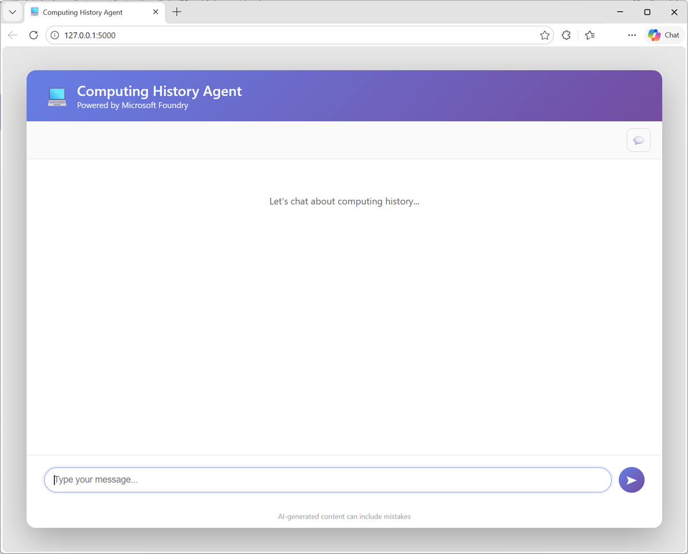

---
lab:
  title: Use your agent in a client application
  description: Use your published agent in a client application.
  level: 200
  duration: 20 minutes
  islab: false
---

# Use your agent in a client application

In the **[previous exercise](./02-continue-in-vscode.md)**, you created and refined a computing history agent in Microsoft Foundry and Visual Studio Code. In this final lab, you move from development into consumption by using the agent in a client app.

Your agent is automatically published with a dedicated endpoint that applications can call by using the OpenAI Responses API. That means you can move beyond playground testing and start integrating the agent into a real user experience.

In this lab, you'll configure and complete a Python client application that sends prompts to your agent's dedicated endpoint.

This exercise should take approximately **20** minutes to complete.

## Get your agent's endpoint

So far you've developed and tested your agent within a Foundry project. To take it into production, you need to write code that consumes it from its dedicated endpoint.

1. If you don;t already have it open; in a web browser, open [Microsoft Foundry](https://ai.azure.com){:target="_blank"} at `https://ai.azure.com` and sign in using your Azure credentials. Then switch to the **New Foundry** view if necessary, and open the project in which you created the *computing-historian* agent.
1. Select the **Build** menu, and in the **Agents** page, select the **computing-historian** agent.
1. In the **Publish** drop-down list, view the published agent **Details**. In particular, note the **Responses** protocol endpoint that clients apps can use to call your agent via the OpenAI Responses API. You'll need this later!

    > **Tip**: Do <u>not</u> publish your agent to Teams and Microsoft 365 in ths exercise.

### Configure a client application in Visual Studio Code

A partially completed client application for your agent has been provided. You'll complete this app and test it with your agent endpoint.

1. Open Visual Studio Code.
1. Open the command palette (*Ctrl+Shift+P*) and use the `Git:clone` command to clone the `https://github.com/MicrosoftLearning/mslearn-agent-quickstart` repo to a local folder (it doesn't matter which one). Then open it.

    You may be prompted to confirm you trust the authors.

1. View the **Extensions** pane; and if it is not already installed, install the **Python** extension.
1. In the **Command Palette**, use the command `python:create envionment`(or `python:select interpreter`) to create a new **Venv** environment based on your Python 3.1x installation.

    > **Tip**: If you are prompted to install dependencies, you can install the ones in the *requirements.txt* file in the */computer-history-client* folder; but it's OK if you don't - we'll install them later!

    Wait for the environment to be created.

1. In the **Explorer** pane, navigate to the folder containing the application code files at **/computer-history-client**. The application files include:
    - **.env** (the application configuration file)
    - **agent_client.py** (the code file for the Python code to interact with your agent)
    - **app.py** (the main code file for a Python Flask-based web application)
    - **README.md** (information about the app)
    - **requirements.txt** (the Python package dependencies that need to be installed)
1. In the **Explorer** pane, right-click the **agent_client.py** file, and select **Open in integrated terminal**.

    > **Note**: Opening the terminal in Visual Studio Code should automatically activate the Python environment after a few seconds. If you're using a PowerShell terminal, you may need to enable running scripts on your system (see [Set-ExecutionPolicy](https://learn.microsoft.com/powershell/module/microsoft.powershell.security/set-executionpolicy){:target="_blank"}). If for any reason the Python environment is not activated automatically, you can use GitHub Copilot to help you activate it.

1. Ensure that the terminal is open in the **/computer-history-client** folder with the prefix **(.venv)** to indicate that the Python environment you created is active.
1. Install the required Python packages by running the following command:

    ```
    pip install -r requirements.txt
    ```

1. In the **Explorer** pane, in the **/computer-history-client** folder, select the **.env** file to open it. Then update the configuration values to replace *your_agent_endpoint_url* with the **Responses API endpoint** for your published agent.

    > **Note**: The endpoint should end with "/openai/responses". If your endpoint ends with "/openai/**v1**/responses", remove "/v1" from the URL. The application code will later remove "/responses" to use the base URL for the responses API for your agent.

1. Save the updated **.env** file.

### Add code to interact with your agent

Now you're ready to implement the code that will submit prompts to your agent.

1. In the **Explorer** pane, in the **/computer-history-client** folder, select the **agent_client.py** file (<u>not</u> *app.py*) to open it.
1. Review the existing code. You will add code to use the OpenAI Response API to interact with your agent.

    > **Tip**: As you add code to the code file, be sure to maintain the correct indentation.

1. Find the comment **Import Azure Identity and OpenAI client libraries**, and add the following code to import the Azure Identity classes required to use Entra ID authentication, and the OpenAI library.

    ```python
   # Import Azure Identity and OpenAI client libraries
   from azure.identity import DefaultAzureCredential, get_bearer_token_provider
   from openai import OpenAI
    ```

1. In the **AgentClient** class, in the ****init**** function, note that code has been provided to load the agent endpoint from the environment configuration file. Then find the comment **Create OpenAI client authenticated with Azure credentials** and add the following code to create an authenticated OpenAI client for your agent:

    ```python
   # Create OpenAI client authenticated with Azure credentials 
   self.client = OpenAI(
        api_key=get_bearer_token_provider(
            DefaultAzureCredential(), 
            "https://ai.azure.com/.default"
        ),
        base_url=self.agent_endpoint,
        default_query={"api-version": "2025-11-15-preview"}
   )
    ```

1. In the **send_message** function, note that code to add the user's prompt to the conversation history has been provided. Then, in the **try** block, find the comment **Send prompt with full conversation history and get response** and add the following code to submit the prompt to the agent and get the response.

    ```python
   # Send prompt with full conversation history and get response
   response = self.client.responses.create(
        input=self.conversation_history
   )
   assistant_message = response.output_text
    ```

1. Read through the rest of the code, using the comments to understand the technique of tracking user inputs and responses in a conversation history.
1. Save the updated **agent_client.py** file.

### Run the client application

Now you're ready to test the app with your agent.

1. In the terminal, use the following command to sign into Azure.

    ```powershell
    az login
    ```

    > **Note**: In most scenarios, just using *az login* will be sufficient. However, if you have subscriptions in multiple tenants, you may need to specify the tenant by using the *--tenant* parameter. See [Sign into Azure interactively using the Azure CLI](https://learn.microsoft.com/cli/azure/authenticate-azure-cli-interactively) for details.

1. When prompted, follow the instructions to sign into Azure. Then complete the sign in process in the command line, viewing (and confirming if necessary) the details of the subscription containing your Foundry resource.
1. After you have signed in, enter the following command to run the application:

    ```powershell
   python app.py
    ```

1. When the Flask application starts, open your browser and navigate to [http://localhost:5000](http://localhost:5000) (`http://localhost:5000`).

    The application web site should looks like this:

    

1. Enter a prompt, such as `What was ENIAC?` and view the response.
1. Follow up with a second prompt, such as `How does it compare with COLOSSUS?`
1. When you're finished testing the app, in the terminal pane, enter **CTRL+C** to stop the local web server.

## Summary

In this exercise, you build a client application that uses an agent you have developed in Microsoft Foundry.

> **[Ask Anton](https://aka.ms/azk-anton){:target="_blank"}**<br/><br/>If you have questions about some of the topics covered in this exercise, *[Ask Anton](https://aka.ms/choose-anton){:target="_blank"}* is a generative AI-based agent that you can ask about AI concepts and Microsoft Foundry. Choose the Azure-based or Browser-based version of the app at **[https://aka.ms/choose-anton](https://aka.ms/choose-anton){:target="_blank"}**.<br/><br/>*Ask Anton is not a supported Microsoft product or a component of Microsoft Learn or AI Skills Navigator. Just an experimental example of an AI agent for you to explore as you learn about what's possible with AI.*<br/><br/>If you *do* check out Ask Anton, we'd love you to *[tell us about your experience](https://forms.office.com/r/fC0ndfBQeK){:target="_blank"}*!

## Next steps

This is the third and final exercise in a series of lab exercises. Check out the following training resources to dive deeper into AI app and agent development on Azure:

- [Develop Generative AI apps in Azure](https://aiskillsnavigator.microsoft.com/explore/search/learningpath-83c73f92b07ec44b678fe87608ac5812111e0caacf7308b47afccec1f274ccc4){:target="_blank"}
- [Develop AI agents on Azure](https://aiskillsnavigator.microsoft.com/explore/search/learningpath-e479cf28c8a127f98d3d45961214485266d85b486991cebf33fe779fb53a0190){:target="_blank"}
- [Develop natural language solutions on Azure](https://aiskillsnavigator.microsoft.com/explore/search/learningpath-37cace5b5d91825002d4c09e3f3f98d9027e1b2a79b490b663684c4703361ca7){:target="_blank"}
- [Extract visual insights from data on Azure](https://aiskillsnavigator.microsoft.com/explore/search/learningpath-d0b0e550fda9d8fc957788736aaee66351967ea44dbad310f4f8dae94a21cfa2){:target="_blank"}
- [Develop AI Information Extraction solutions on Azure](https://aiskillsnavigator.microsoft.com/explore/search/learningpath-796e69a13e07dffb16c3a979eb65711e5884ecee17cf595f4eb9b604e919a428){:target="_blank"}

> **Tip**: If you have finished exploring Microsoft Foundry, you should delete the Azure resources created in this exercise to avoid unnecessary utilization charges.
